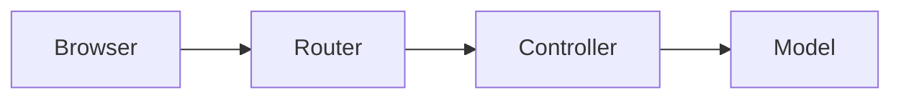
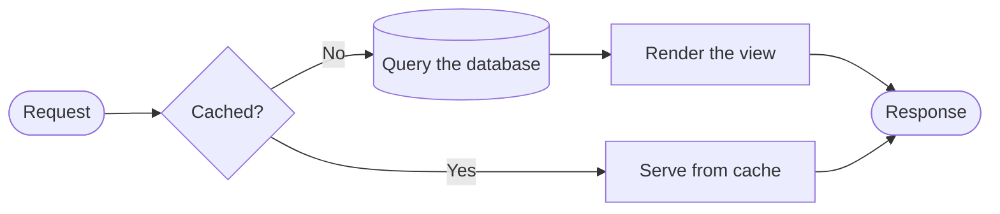
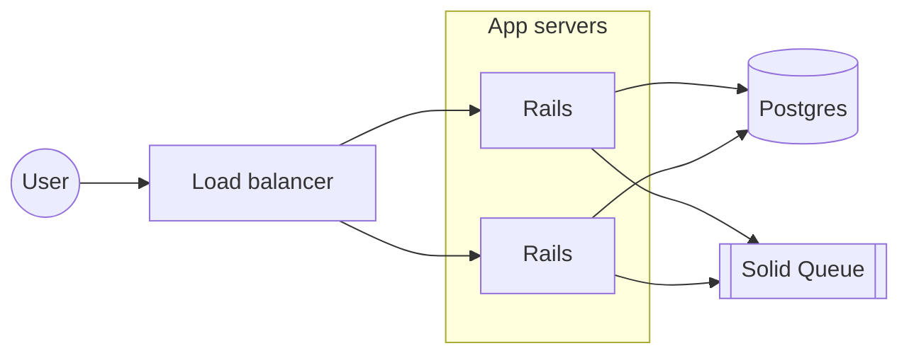
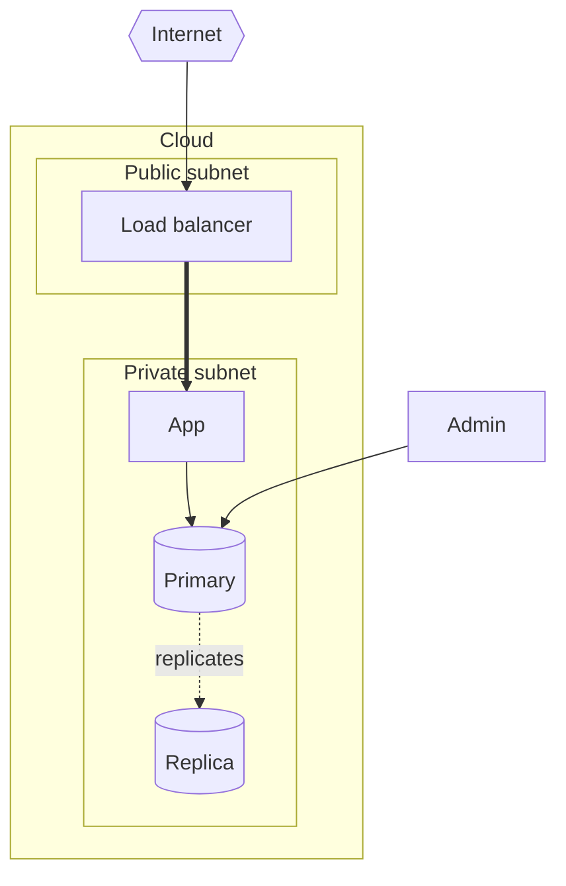
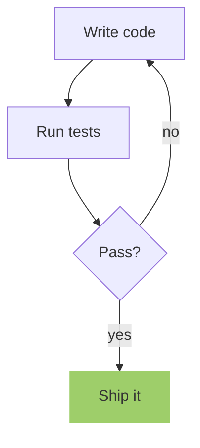
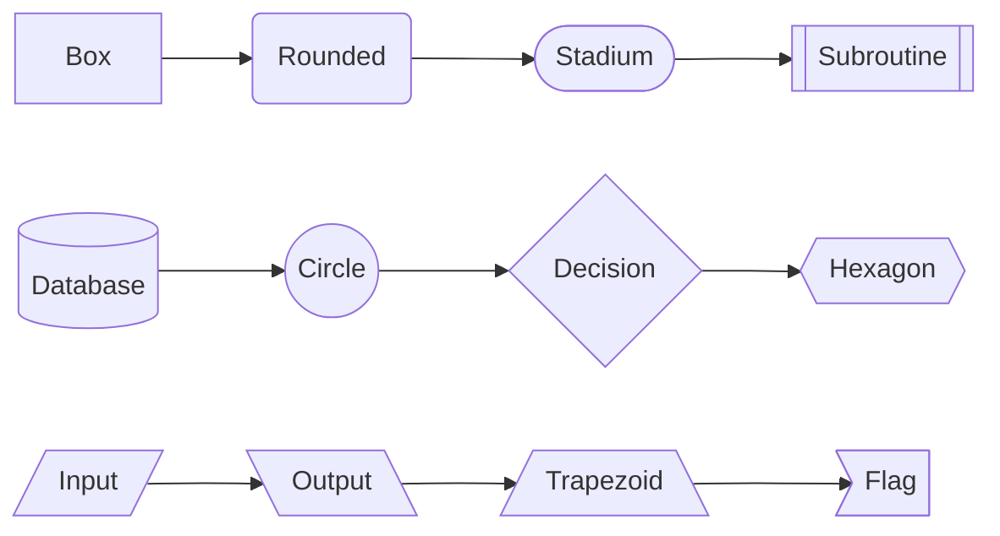

# Diagrams

Mermaid flowcharts, drawn in your theme

---

# A pipeline

```mermaid
flowchart LR
  Browser --> Router --> Controller --> Model
```

---

# A decision

```mermaid
flowchart LR
  request([Request]) --> cached{Cached?}
  cached -->|Yes| serve[Serve from cache]
  cached -->|No| query[(Query the database)]
  query --> render[Render the view]
  render --> done([Response])
  serve --> done
```

---

# An architecture

```mermaid
flowchart LR
  user((User)) --> lb[Load balancer]
  subgraph app [App servers]
    web1[Rails] & web2[Rails]
  end
  lb --> web1 & web2
  web1 & web2 --> db[(Postgres)]
  web1 & web2 --> jobs[[Solid Queue]]
```

---

```mermaid
flowchart TB
  internet{{Internet}} --> lb
  subgraph cloud [Cloud]
    subgraph public [Public subnet]
      lb[Load balancer]
    end
    subgraph private [Private subnet]
      app[App] --> db[(Primary)]
      db -.->|replicates| replica[(Replica)]
    end
    lb ==> app
  end
  admin[Admin] --> db
```

---

# A loop

```mermaid
flowchart TD
  write[Write code] --> test[Run tests]
  test --> pass{Pass?}
  pass -- no --> write
  pass -- yes --> ship[Ship it]
  classDef done fill:#9ece6a,stroke:#9ece6a
  class ship done
```

---

# Every shape

```mermaid
flowchart LR
  a[Box] --> b(Rounded) --> c([Stadium]) --> d[[Subroutine]]
  e[(Database)] --> f((Circle)) --> g{Decision} --> h{{Hexagon}}
  i[/Input/] --> j[\Output\] --> k[/Trapezoid\] --> l>Flag]
```
